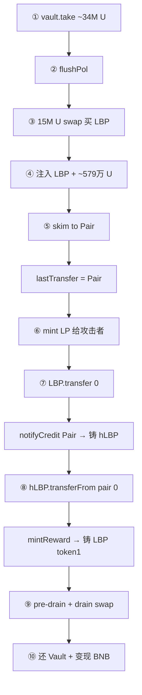
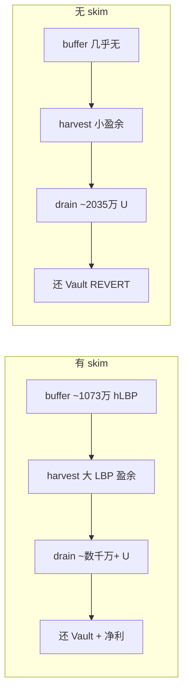
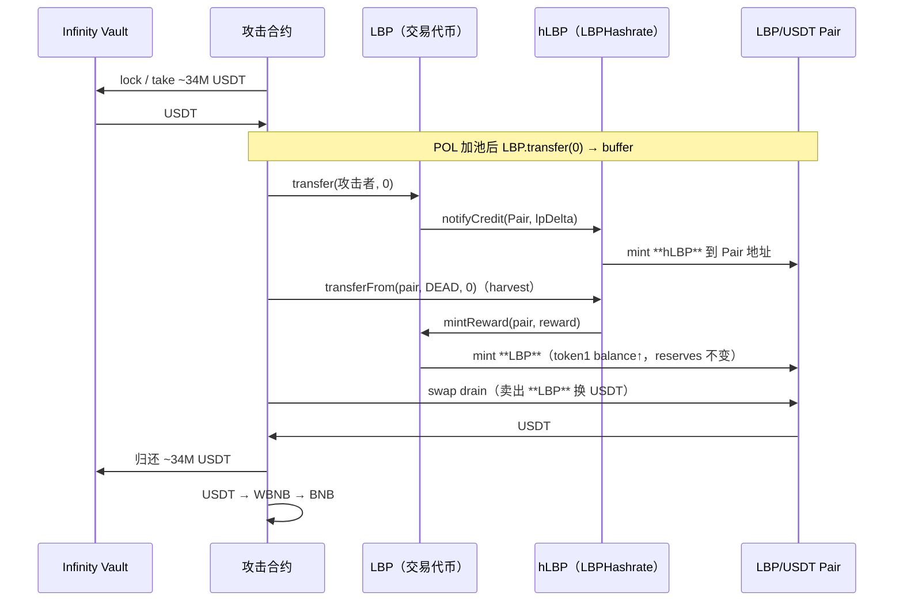

# Little Boy Plus (LBP) 池子操纵攻击 — 技术复盘

**交易哈希：** `0x55856d9fda4c5be5193561c7d775e823c3d6e499da44aab9da963daf61c50b0c`  
**链：** BNB Smart Chain (BSC)  
**区块：** `104727184`（区块内 Position #61）  
**时间：** 2026-06-17 08:35:38 UTC  
**BscScan：** https://bscscan.com/tx/0x55856d9fda4c5be5193561c7d775e823c3d6e499da44aab9da963daf61c50b0c  
**Phalcon 调用链：** https://app.blocksec.com/phalcon/explorer/tx/bsc/0x55856d9fda4c5be5193561c7d775e823c3d6e499da44aab9da963daf61c50b0c  
**SlowMist 告警：** https://x.com/SlowMist_Team/status/2067424733747122259

---

## 1. 执行摘要

2026 年 6 月 17 日，攻击者对 BSC 上的 **Little Boy Plus（LBP）** 生态发起单笔原子交易攻击。根据 [SlowMist](https://x.com/SlowMist_Team/status/2067424733747122259) 分析，**根因是 `LBPHashrate._update()` 在零金额转账时仍执行 `_harvest()`，任意地址可 `transferFrom(pair, …, 0)` 代 Pair 触发 `LBP.mintReward`，向 PancakePair 铸造 LBP 奖励且不更新 reserves，造成 Pair 余额与储备脱节，攻击者再通过 `swap` 抽走 USDT**（非 allowance 校验问题：零金额时 `allowance >= 0` 恒成立）。攻击者借助 Moolah 闪电贷放大资金规模，最终变现约 **377,642 USDT（~610.555 BNB）**。

| 指标 | 数值 |
|------|------|
| 估计总损失 | ~377,642 USDT（SlowMist）/ ~610.555 BNB |
| 攻击者链上留存（本 tx） | ~605.55 BNB（扣 5 BNB MEV 贿赂后） |
| 闪电贷规模 | ~7,772,960 USDT（Moolah）+ ~34,088,144 USDT（Infinity Vault 同 tx 借还） |
| Gas 消耗 | 4,809,427 / 4,969,843（96.77%） |
| 交易费 | ~0.0048 BNB（~$2.87） |
| BEP-20 转账笔数 | 80 |
| 事件日志 | 435+ |

**漏洞类型**：`LBPHashrate._update` 对零金额转账仍执行 `_harvest` + 第三方可代 Pair 触发 + `mintReward` 不更新 reserves → Pair **balance ≠ reserves** 套利（与 BY Token 的 `triggerAutoBurn` 路径不同，但同属 AMM 储备失衡类攻击）。

---

## 2. 参与地址

| 角色 | 地址 | 说明 |
|------|------|------|
| 攻击者 EOA | `0xb26DFE6b6180A30e2A2D9826867cc7e06631825a` | 发起交易、部署攻击合约 |
| 攻击工厂合约 | `0x202bA7498C65F9F5C49b9c90953B562F9e0538FB` | 本交易内 CREATE |
| 攻击编排合约 | `0x5449ded887576f43Fc339851e942eBc1E6F8118b` | SlowMist 标注的攻击合约 |
| **LBP Token**（交易代币） | `0x88886f0fD371dfF856291bAdcEd45922bC888888` | **Little Boy Plus**；受害 Pair 的 **token1**；`swap` 买卖的是它 |
| **hLBP / LBPHashrate**（算力代币） | `0x5e3cbc82d020be91a989eb747934104e9ab585fe` | Phalcon 标注 **hLBP**；独立 ERC20；`notifyCredit` / `_harvest` 所在合约 |
| 受害 Pair | `0x00e3Ea08fD8CBaD955Ec5d2292Ad637670c31524` | LBP/USDT Pancake V2；token0=USDT / **token1=LBP**（不是 hLBP） |
| USDT/WBNB Pair | `0x16b9a82891338f9bA80E2D6970FddA79D1eb0daE` | 最终变现路径 |
| **PolVault**（POL 缓冲） | `0x01c87119a0D1C3730534b8d909eFeB1911b9fdB0` | `flushPol`：缓冲 LBP/USDT → 在受害 Pair 上 swap + 加池；`pair()` = 受害 Pair |
| PolVault 相关 | `0xdba2097923b75921657054af11be74475d2105ee` | POL 缓冲金库 |
| LP 质押代币 | `0xC6E06d3F7eD6475a555F4E23286a28F9Ed3c7E81` | 关联 LP 凭证 |
| Moolah 闪电贷 | `0x8F73b65B4caAf64FBA2aF91cC5D4a2A1318E5D8C` | Lista / Moolah 借贷市场 |
| WBNB 闪电来源 | `0x238a358808379702088667322f80ac48bad5e6c4` | **PancakeSwap Infinity Vault**（非 V2 池；`vault.take` 打出 USDT） |
| Pancake Router V2 | `0x10ED43C718714eb63d5aA57B78B54704E256024E` | 路由 swap |
| USDT | `0x55d398326f99059fF775485246999027B3197955` | Binance-Peg USDT |
| WBNB | `0xbb4CdB9CBd36B01bD1cBaEBF2De08d9173bc095c` | Wrapped BNB |

**LBP 代币构造参数（BscScan 已验证源码）：**

| 参数 | 地址 / 值 |
|------|-----------|
| devWallet | `0x7aE1685AA6bB0847bD3f1a48bAa570dA878a486f` |
| receiver | `0x51EDEAb1CEa55570b246b3A1E42DAba9027c5cc2` |
| HashrateRegistry | `0xf0C8999a2094204831c0B349383d9ECfB5203a9a` |
| Pancake Factory | `0xcA143Ce32Fe78f1f7019d7d551a6402fC5350c73` |

### 2.1 LBP 与 hLBP 辨析（勿混淆）

生态里有两个不同的 ERC20，Phalcon / 链上 trace 与 BscScan 命名容易混成一团：

| | **LBP**（Little Boy Plus） | **hLBP**（LBPHashrate） |
|--|---------------------------|-------------------------|
| 地址 | `0x88886f0f…` | `0x5e3cbc82…`（Phalcon 标 **hLBP**） |
| 角色 | 受害 **交易代币**；Pair **token1** | **算力 / 质押** 代币；独立 ERC20 |
| AMM | `pair.swap` 买卖的是 **LBP ↔ USDT** | **不是** Pair 的 token0/token1 |
| 铸币到 Pair 地址 | `LBP.mintReward(pair, …)`（harvest 路径） | `hLBP.notifyCredit` → `hLBP.Transfer` mint 到 Pair 地址 |
| 影响 `getReserves()` 的 LBP 侧 | **会**：`mintReward` 增加 **LBP** `balanceOf(pair)`，reserves 不变 | **不会直接**：只增加 **hLBP** `balanceOf(pair)`，不改变 Pair 内 **LBP** reserves |
| 典型触发 | `hLBP.transferFrom(pair, DEAD, 0)` → `_harvest` | `LBP.transfer(…, 0)` 钩子 → `hLBP.notifyCredit` |

**套现（drain）看的是 Pair 上 token1（LBP）的 `balanceOf` 与 `getReserves()` 之差**，不是 hLBP 余额。两条铸币路径：

1. **buffer**：`skim(Pair)` → `lastTransfer=Pair` → `mint` → `LBP.transfer(0)` → `notifyCredit(Pair)` → 约 **1,073 万 hLBP** 到 Pair **地址**。
2. **harvest（根因）**：`hLBP.transferFrom(pair, 0)` → `LBP.mintReward` → **LBP（token1）** 进 Pair，`reserves` 不变。

---

## 3. 协议架构（简化）

```
┌──────────────────────────────────────────────────────────────┐
│  LBP（Little Boy Plus，0x8888…）— 交易代币 / Pair token1      │
│  · 转账钩子 / 卖税                                            │
│  · onPolStart / onPolEnd（POL）                               │
│  · transfer(0) 钩子 ──────────────┐                           │
└──────────────────────────────────│──────────────────────────┘
                                   │ 调用
                                   ▼
┌──────────────────────────────────────────────────────────────┐
│  hLBP / LBPHashrate（0x5e3c…）— 算力 ERC20，Phalcon 标 hLBP    │
│  · notifyCredit(pair, lpDelta) → mint hLBP 到 Pair 地址       │
│  · transferFrom(pair,…,0) → _harvest → LBP.mintReward(pair)    │
└───────────────┬──────────────────────────────┬───────────────┘
                │ mint hLBP（buffer）            │ mint LBP（harvest）
                ▼                                ▼
┌──────────────────────────────────────────────────────────────┐
│  Pancake Pair 0x00e3…（Cake-LP，token0=USDT / token1=LBP）     │
│  · hLBP.balanceOf(pair) ↑  — buffer，不参与 AMM 定价          │
│  · LBP balance（token1）↑，reserves 不变 — harvest，可 drain   │
└──────────────────────────────────────────────────────────────┘
```

LBPHashrate 继承 OpenZeppelin ERC20：攻击者调用 `transferFrom(pair, DEAD, 0)` 时，`_update()` 在 **`value == 0` 时仍执行 `_harvest(pair)`** 并调用 **`LBP.mintReward` 铸 LBP**（不是铸 hLBP）。根因不在 allowance 校验缺失——即使强制检查，`allowance >= 0` 对任意 `uint256` allowance 恒成立，**无法**靠 allowance 拦住零金额调用。

---

## 4. 漏洞根因（SlowMist）

> 来源：[SlowMist TI Alert](https://x.com/SlowMist_Team/status/2067424733747122259)

### 4.1 核心问题：零金额 `_update` 仍 `_harvest` → Pair 铸币失衡

漏洞位于 **`LBPHashrate._update()`**（合约 `0x5e3cbc82d020be91a989eb747934104e9ab585fe`）：

```solidity
// 攻击者调用 hLBP（LBPHashrate）合约：
LBPHashrate.transferFrom(pair, DEAD, 0);  // Phalcon: hLBP.transferFrom

// 内部链路（SlowMist 归纳）：
transferFrom(pair, DEAD, 0)
  → _update(from=pair, to=DEAD, value=0)   // amount=0 仍进入钩子
  → _harvest(pair)                           // 以 Pair 为上下文结算奖励
  → LBP.mintReward(pair, reward)             // 向 Pair 地址铸造 LBP
  → Pair 的 LBP balance 增加，但 reserves 未更新
```

**为何零金额 `transferFrom` 仍可触发 harvest？**

| 缺陷点 | 正常预期 | 实际行为 |
|--------|----------|----------|
| `_update` 对 `value == 0` | 无资金移动，不应结算奖励 | **仍调用 `_harvest(from)`** |
| 谁可以触发 Pair 的 harvest | 仅 Pair 自身或受控入口 | **任意地址** 可 `transferFrom(pair, …, 0)` 代 Pair 触发 |
| `allowance` 能否拦住 | — | **不能**：`amount=0` 时条件为 `allowance >= 0`，对任意 `uint256` allowance **恒成立**；OZ 跳过检查只是实现细节，非根因 |
| Pair 铸币后 reserves | balance 与 reserves 应一致 | `mintReward` 只增 **balance**，**reserves 不变** |

### 4.2 套利闭环：balance > reserves → `swap` 抽 USDT

PancakeSwap V2 定价依赖 **reserves**（`getReserves()`），而 `swap` 结算使用 **实际 token 余额**。当 Pair 被 `mintReward` 注入大量 LBP 后：

```
reserves 仍按旧比例记录（LBP 侧偏低）
实际 balance 已因铸币大幅增加（LBP 侧偏高）

→ 攻击者用少量 LBP 按失真价格 swap 出大量 USDT
→ 链上最终抽走约 377,642 USDT（SlowMist）
```

这与「向 Pair 注入代币但不 `sync`」的经典套利模式一致；本案例的 **注入来源不是直接 transfer，而是 Hashrate 合约的 `_harvest` + `mintReward`**。

### 4.3 闪电贷的角色

**链上交易**同时使用两路 USDT：

| 来源 | 借入 (USDT) | 归还 |
|------|-------------|------|
| Moolah `0x8F73b65B…` | ~7,772,960 | 同额 log#143 |
| Infinity Vault `0x238a3588…` | ~34,088,144 | 同额 log#142 |

操纵阶段实际打进受害 Pair 的 USDT 约 **2,079 万**（1,500 万 swap + ~579 万 POL 注入）。Infinity Vault 单路 **~3,408 万** 已可覆盖。

**fork PoC 验证**（block `104727183`）：移除 Moolah 后 exploit 仍成功，净利润与含 Moolah 版本 **完全一致**。Moolah ~777 万在回调中闲置并最终归还，**不改变 exploit 结果**；链上并列使用更可能是攻击者模板习惯，而非本漏洞硬性依赖。

### 4.4 `bufferProcessed` / `notifyCredit`（POL 收尾 — 铸 **hLBP**）

`pair.mint(攻击者)` 之后，`LBP.transfer(攻击者, 0)` 走 **LBP 合约**转账钩子，内部调用 **hLBP** 的 `notifyCredit`（log#70 附近 `bufferProcessed`）：

```
pair.mint(攻击者)              // 记录 lpDelta
LBP.transfer(攻击者, 0)        // 零金额，触发 LBP 钩子（不是 hLBP.transfer）
  → hLBP.notifyCredit(user=Pair, lpDelta=…)
  → hLBP.Transfer(from=0x0, to=Pair, value≈10,737,390,507…)
  → emit HashrateCredited / bufferProcessed
```

| 项目 | 说明 |
|------|------|
| 增加余额 | **Pair 地址上的 hLBP**（`hLBP.balanceOf(Pair)` ↑） |
| 不是 | Pair 池内 **LBP（token1）** 余额、也不是 `getReserves()` 里的 LBP |
| 规模 | 约 **1,073 万 hLBP**（链上 raw `10,737,390,507,980,558,866,879,696`） |

该路径为 POL/算力 **buffer 收尾**；**直接造成 AMM 可套现 LBP 盈余的是 §4.1 的 `mintReward`（LBP）**。

**`lastTransfer` 如何变成 Pair（fork 实测）**：PoC 在注入 LBP+USDT 后调用 `pair.skim(VICTIM_PAIR)`（`to` = Pair 自己）。skim 触发 **from = Pair** 的 LBP 转账，LBP `_update` 将 **`lastTransfer` 写成 Pair 地址**；随后 `mint` + `transfer(0)` 触发 Layer 7a settle 时，`notifyCredit(lastTransfer_, …)` 的第一个参数即为 **Pair**，从而向 Pair 地址铸 **hLBP**（非向攻击者）。

**skim 是否可省略（fork ablation）**：在 `AttackLittleBoyPlus.sol` 中注释掉 `pair.skim` 后重跑 `LittleBoyPlusChallenge`（block `104727183`）：攻击在 **⑩ 还 Vault** 时 `revert`（`BEP20: transfer amount exceeds balance`）。无 skim 时 **⑧ harvest 与 ⑨ drain 仍会执行**，主 `swap` 约换回 **~2,035 万 USDT**，但攻击合约 USDT 不足以归还 Vault 借出的 **~3,408 万 USDT**。有 skim 时净利 **~369,624 USDT**。故 skim 对 **buffer 放大 + 整体可盈利** 均为必需，而非可有可无的辅助调用（详见 **§5.2「skim 必要性」**）。

### 4.5 与 BY Token 攻击的对比

| 维度 | BY Token（2026-06-04） | Little Boy Plus（本 tx） |
|------|------------------------|---------------------------|
| 失衡来源 | `triggerAutoBurn()` 烧 Pair 内 LBP + `sync()` | `mintReward(pair)` 向 Pair **铸入** LBP |
| 触发入口 | 无权限 `triggerAutoBurn()` | 零金额 `LBPHashrate.transferFrom(pair, DEAD, 0)` |
| 授权/准入 | 不涉及 | **非 allowance 问题**：零金额 `allowance>=0` 恒成立；根因是 `_update(0)` 仍 harvest + 第三方可代 Pair 触发 |
| 储备机制 | burn 后 `sync` 压低 LBP reserve | 铸币不更新 reserve |
| 变现 | WBNB `swap` | USDT `swap` → WBNB → BNB |
| 利润 | ~146 BNB (~$87k) | ~610.55 BNB / ~377k USDT |

共同点：Pair **balance 与 reserves 不一致** 后通过 `swap` 套利；**触发路径完全不同**。

### 4.6 设计缺陷归纳

1. **`_update()` 对 `value == 0` 仍执行 `_harvest`** — 应 early-return，零金额不应触发奖励逻辑。
2. **`transferFrom` 允许第三方以 Pair 为 `from` 触发 harvest** — `_harvest` 应校验 `msg.sender` 或要求 Pair 主动调用。
3. **`mintReward` 直接向 Pair 铸币且不触发 `sync`** — 铸币后应禁止套利窗口（立即 sync 或由 Pair 专用入口处理）。
4. **勿将根因归为 allowance** — 零金额 `transferFrom` 即使强制检查 allowance 也无法拦截（`allowance >= 0` 恒真）；修补应针对 `_update` 零金额语义与 harvest 准入。

---

## 5. 攻击流程

### 5.1 总览对比

| | 链上原始 tx | 本仓库 PoC |
|--|-------------|------------|
| 入口 | Moolah `flashLoan` → Vault `take` | 直接 `vault.lock()` → `take` |
| 额外小单 | swap #1 1,000 U、`mint(Pair)`、swap #3 1 U | **已省略**（fork 利润一致） |
| Moolah ~777 万 U | 借还 | **已省略**（非必需） |
| POL→buffer→harvest→drain | ✅ | ✅ 见 **§5.2** |

链上总览（含 Moolah / 小单）：

```
① 部署攻击合约
②（链上）Moolah 闪电贷 ~7.77M U
③ Infinity Vault.take ~34.08M U
④ 操纵 Pair：swap + POL 注入 → skim → mint → LBP.transfer(0) → buffer（hLBP）
⑤ hLBP.transferFrom(pair, 0) → harvest（LBP mintReward）
⑥ pre-drain + drain swap → 套 USDT
⑦ 还 Vault（+ 链上还 Moolah）
⑧ USDT → WBNB → BNB
```

---

### 5.2 PoC 逐步详解（`AttackLittleBoyPlus.sol` — 每一步都关键）

以下与 `lockAcquired` 内代码顺序一致（fork block `104727183`）。**省略任一步，后续 settle / 铸币 / 套现链可能断掉或利润骤降。**

#### 流程图



#### 逐步表

| 步 | PoC 代码（约行） | 做什么 | `lastTransfer`（fork） | 为何关键 |
|----|------------------|--------|------------------------|----------|
| **①** | `vault.take(全部 USDT)` | Infinity Vault 打出约 **3,408 万 U** | `0x0` | **唯一本金**：~2,079 万进池操纵 + 还须同额归还；无 `deal` |
| **②** | `flushPol()` | PolVault 缓冲冲刷、`onPolStart` 侧 POL 逻辑 | `0x0` | 激活/清空 POL 缓冲，与后续加池、`bufferProcessed` 时序配套 |
| **③** | `15M U` + `pair.swap` 买 LBP | 大额 USDT→LBP，**扭曲 reserves**（池内 U 多、LBP 少） | `0x0` | 拉高后续 POL 所需 LBP 规模，并把池子比例打成利于后面 **大额 drain** 的状态 |
| **④** | `lbp.safeTransfer(pair)` + `usdt.safeTransfer(pair)` | 按 reserves 比例注入 **LBP + ~579 万 U** | `0x0` | 在 Pair 上形成 **超额余额**（`balance > reserves`），待 `mint` 收成 LP；攻击者从③获得 LBP |
| **⑤** | `pair.skim(VICTIM_PAIR)` | 超额代币扫给 `to=Pair` 自己 | **`Pair`** | **枢纽步**：skim 触发 `from=Pair` 的 LBP `_update`，**`lastTransfer` 被写成 Pair 地址**（fork 实测）；否则后面 `notifyCredit` 的 `user` 不是 Pair。**不可省略**（见下节 ablation） |
| **⑥** | `pair.mint(攻击者)` | 用超额 U+LBP 铸 **Cake-LP 给攻击者** | `Pair` | `totalLp` / `kLast` 变化，产生 **`lpDelta ≈ 23.21e21`**；LP 凭证在攻击者手里，但算力记账主体将是 Pair |
| **⑦** | `lbp.transfer(self, 0)` | 零金额 LBP 转账，跑满 `_update` 管道 | `0x0`（settle 后清空） | **buffer**：`lastTransfer==Pair` → Layer 7a `_verifyAndSettle` → `notifyCredit(Pair, lpDelta)` → 约 **1,073 万 hLBP** 铸到 **Pair 地址**（`hLBP.Transfer`，不是 LBP token1） |
| **⑧** | `hLBP.transferFrom(pair, DEAD, 0)` | 零金额 `transferFrom`，**不走 LBP Layer 2.5** | — | **harvest 根因**：`value==0` 仍进 `_update`→`_harvest`→`mintReward`；Pair **token1（LBP）** `balance↑`，`reserves` 不变 |
| **⑨** | 两次 `lbp→pair` + `pair.swap` | pre-drain 打回 LBP；按 **LBP 盈余** 一次 drain | — | 把 `balance - reserve` 的 **LBP** 换成 USDT；链上主 drain 约 **2,117 万 U** 量级 |
| **⑩** | `vault.sync` + 还 U + `settle` | 归还 **3,408 万 U** | — | Vault 记账闭合；剩余 USDT 为净利润 |
| **⑪** | `attack()` 内 USDT→WBNB→BNB | 变现并转给调用者 | — | PoC 净赚约 **369,624 U / ~597.87 BNB**（无 MEV 贿赂） |

#### 两个「零金额」触发器（勿混）

| 调用 | 合约 | 铸什么 | 依赖的前置状态 |
|------|------|--------|----------------|
| `LBP.transfer(攻击者, 0)` | LBP `_update` | **hLBP** → Pair 地址 | **⑥ mint** 产生 `lpDelta`；**⑤ skim** 使 `lastTransfer=Pair` |
| `hLBP.transferFrom(pair, DEAD, 0)` | hLBP `_update` | **LBP** → Pair（token1） | 池子已操纵；**`_update(0)` 仍 harvest**，任意地址可代 Pair 触发 |

LBP 合约 **Layer 2.5** 只挡 `LBP.transferFrom(pair, 0)`，**挡不住** 上表两行。

#### `lastTransfer` 时间线（fork 实测）

```
注入 LBP/USDT 后     lastTransfer = 0x0
skim(Pair)           lastTransfer = Pair  ← ⑤
mint(攻击者)         lastTransfer = Pair
transfer(0) settle   lastTransfer = 0x0   ← settle 清空
```

Phalcon 里 `notifyCredit(user=Pair)` 的 `user`，就是 settle 时读到的 **`lastTransfer`（已为 Pair）**，不是 Cake-LP 持有人（攻击者）。

#### skim 必要性（fork ablation）

在 PoC 中去掉 `pair.skim(C.VICTIM_PAIR)` 后，用 `forge test --match-contract LittleBoyPlusChallenge` 在 fork block `104727183` 对照：

| 场景 | 结果 | 说明 |
|------|------|------|
| **有 skim** | ✅ PASS | 净利 **~369,624 USDT** / **~597.87 BNB**（还 Vault 后） |
| **无 skim** | ❌ REVERT | `usdt.safeTransfer(vault, vaultUsdt)` 失败：`BEP20: transfer amount exceeds balance` |

无 skim 时攻击链 **并未在 buffer ⑦ 就断掉**——trace 显示 **⑧ harvest** 与 **⑨ 主 drain swap** 仍会跑完，主 `swap` 约换回 **~2,035 万 USDT**。但缺少 skim 导致的 **`lastTransfer=Pair` → notifyCredit(Pair) → ~1,073 万 hLBP** 放大后，harvest 铸入 Pair 的 **LBP（token1）** 盈余不足，套现 USDT 无法覆盖 Vault 借出的 **~3,408 万 USDT**，攻击在还贷步必然失败。

归纳：

1. **对 harvest 根因**（零金额 `hLBP.transferFrom`）：skim **不直接必需**，harvest 路径本身仍可触发。
2. **对本 tx / PoC 的完整套利**：skim **必需**——它是把 POL 注入 + `mint` 与 `notifyCredit(Pair)` 串起来的枢纽，决定 buffer 规模，进而决定 drain 能否覆盖 Vault 并留下利润。
3. **链上攻击者**同样调用了 `skim(Pair)`，与 PoC 一致，并非可选装饰。



#### 代币与池子账本（drain 前）

| 账本 | buffer ⑦ 之后 | harvest ⑧ 之后 |
|------|---------------|----------------|
| `hLBP.balanceOf(Pair)` | ↑ 约 1,073 万 | 不变（drain 不看它） |
| `LBP.balanceOf(Pair)`（token1） | 不变 | ↑ `mintReward` |
| `getReserves()` LBP 侧 | 不变 | **仍不变** → 可 drain |

#### PoC 指标（fork `104727183`）

| 指标 | 数值 |
|------|------|
| 净赚 USDT（还 Vault 后） | **~369,624 U** |
| 换成 BNB | **~597.87 BNB** |
| 操纵进池 USDT 约 | 1,500 万 + ~579 万 ≈ **2,079 万** |
| Vault 借还 | **~3,408 万** |

---

### 5.3 分步详解（链上原始交易）

#### Step 0：合约部署

攻击者 EOA 调用 `0x60806040`（内嵌字节码），在同一交易内部署：

- `0x202bA749...` — 工厂 / 入口
- `0x5449ded8...` — 主攻击合约（闪电贷回调 `onMoolahFlashLoan`，selector `0x13a1a562`）

#### Step 1：Moolah 闪电贷

```
来源：   0x8F73b65B4caAf64FBA2aF91cC5D4a2A1318E5D8C (Moolah)
借入：   7,772,960.679833989887601242 USDT（18 decimals）
        日志 assets = 7772960679833989887601242
接收：   0x5449ded887576f43Fc339851e942eBc1E6F8118b
```

攻击合约对 Moolah 市场执行 `approve`（无限额度），随后在回调中完成全套操纵。

#### Step 1b：Infinity Vault 打出 USDT（第二路本金）

在 Moolah 回调早期，攻击合约通过 **PancakeSwap Infinity Vault**（[官方地址](https://developer.pancakeswap.finance/contracts/infinity/resources/addresses) `0x238a3588…`）的 flash accounting 取出 USDT：

| 方向 | 金额 (USDT) | log# |
|------|-------------|------|
| Vault → 攻击合约 | **34,088,143.96** | 4 |
| 攻击合约 → Vault（归还） | **34,088,143.96** | 142 |

与 Moolah 7.77M 合计，攻击合约在操纵阶段可用 USDT 约 **4,168 万**；其中 **1,500 万** 大额 swap 主要来自 Vault 这路，而非 Moolah 单独能覆盖。

#### Step 2：Pair 操纵 + buffer（harvest 之前）

链上在 harvest 前还有 swap #1/#3 等小单；PoC 省略后从大额 swap 起与 **§5.2 ③–⑦** 对齐。核心子步骤：

| 子步 | 动作 | 说明 |
|------|------|------|
| 注入 | LBP + ~579 万 U 进 Pair | 形成超额余额 |
| **`skim(Pair)`** | **`lastTransfer` → Pair** | 与 PoC **⑤** 相同，buffer 前置条件；**fork 实测不可省略**（无 skim 则还 Vault 失败，见 **§5.2 skim 必要性**） |
| `mint` | LP 给攻击者或链上曾 `mint(Pair)` | 产生 `lpDelta` |
| `LBP.transfer(0)` | `notifyCredit(Pair)` | 约 **1,073 万 hLBP** 铸到 Pair 地址（log#70） |

#### Step 3：零金额 `transferFrom` 触发 `_harvest`（核心根因）

```
LBPHashrate.transferFrom(
    from   = 0x00e3Ea08...  (LBP/USDT Pair)
    to     = 0x000...dEaD   (或 burn 地址)
    amount = 0
)
```

该调用触发：

1. `_update(pair, DEAD, 0)` — **`value == 0` 仍进入钩子**（非 allowance 绕过：`allowance >= 0` 对零金额恒成立，检查 allowance 也拦不住）
2. `_harvest(pair)` — 第三方代 Pair 结算奖励
3. `LBP.mintReward(pair, reward)` → Pair **地址**收到 **LBP**（`LBP` `Transfer` 事件，不是 hLBP）
4. Pair **token1（LBP）余额**增加，`getReserves()` **不变**

链上可见多条 **LBP** `Transfer` 流向 Pair（本 tx 共 7 条），来自 `mintReward` 内部分配；与 buffer 路径的 **hLBP.Transfer** 是不同合约、不同代币。

#### Step 4：`PancakePair.swap` 主套现 + 还贷 + 变现

在 balance > reserves 状态下，攻击合约对受害 Pair 执行 **主 drain swap**（log#141）：

```
输入：  ~141,680 LBP
输出：  大量 USDT（Pair 事件 amount0Out；攻击合约最终持有足够 USDT 还贷并变现）
```

受害 Pair 上共 5 次 swap 事件；其中 **4 次为操纵期 USDT→LBP**，**1 次为套现期 LBP→USDT**。

随后按顺序：

1. 归还 Infinity Vault **34,088,143.96 USDT**（log#142）
2. 归还 Moolah **7,772,960.68 USDT**（log#143）
3. USDT/WBNB Pair swap **377,642.57 USDT → 610.55 WBNB**（log#148）

#### Step 5：辅助操作说明

交易中另含 **`skim(Pair)`**（**枢纽步**，见 §5.2 ablation）、Hashrate 多级奖励分配、PolVault 向多地址转出 LBP 等。`skim` 负责把 `lastTransfer` 设为 Pair 以触发 buffer 放大；**SlowMist 根因仍为 Step 3 的零金额 `_update`→`_harvest`**，但无 `skim` 则本 tx 无法还 Vault 盈利。

#### Step 6：变现 WBNB → BNB

在 USDT/WBNB Pair `0x16b9a828...` 上最终 Swap（日志 #434）：

```
amount0In (USDT): 377,642.570849956957317599
amount1Out (WBNB): 610.555786330933864102
```

攻击合约将 WBNB 解包为原生 BNB：

| 内部转账 | 金额 (BNB) | 说明 |
|----------|------------|------|
| WBNB → 攻击合约 | 610.555786330933864102 | withdraw 解包 |
| 攻击合约 → Builder | 5 | MEV 贿赂 |
| 攻击合约 → 攻击者路径 | 605.555786330933864102 | 净利润 |

按 BscScan 当日估值，净利润约 **$361,086**。

#### Step 7：归还闪电贷

回调结束前完成 Vault + Moolah 双路 USDT 归还（见 Step 4）。

---

## 6. Phalcon 调用链详解（链上完整交易）

> 本节描述 **原始攻击 tx** 的 Phalcon 调用链，包含 Moolah 与额外小单 swap；本仓库 PoC 已精简为 §5.1b 路径。
>
> 数据来源：[BlockSec Phalcon Invocation Flow](https://app.blocksec.com/phalcon/explorer/tx/bsc/0x55856d9fda4c5be5193561c7d775e823c3d6e499da44aab9da963daf61c50b0c)（结合 BscScan 事件 log 序号对齐）

### 6.1 顶层调用序列

| # | 类型 | 调用方 → 被调用方 | 函数 / 动作 | 说明 |
|---|------|-------------------|-------------|------|
| 0 | — | `0xb26DFE6b…` EOA | 发送交易 | Sender |
| 1 | CREATE | EOA → `0x202ba749…` | 部署工厂字节码 | 本 tx `contractAddress` |
| 2 | CREATE | 工厂 → `0x5449ded8…` | 部署攻击合约 | selector `0x5258a367` |
| 3 | CALL | 攻击合约 → Moolah | `approve` ×2 | USDT / WBNB 无限授权 |
| 4 | CALL | 攻击合约 → Moolah | `flashLoan(USDT, 7,772,960.68…)` | `0xe0232b42` |
| 5+ | CALL | Moolah → 攻击合约 | `onMoolahFlashLoan` | `0x13a1a562`；下表为回调内主要阶段 |

### 6.2 `onMoolahFlashLoan` 回调内阶段

```
┌─ onMoolahFlashLoan ──────────────────────────────────────────────┐
│ [A] 第二路本金                                                    │
│     Infinity Vault (0x238a3588…) vault.take / router 路径          │
│     → 攻击合约 +34,088,143.96 USDT（log#4）                       │
│                                                                  │
│ [B] 受害 Pair 操纵（log#5–69，早于 harvest）                      │
│     · USDT→LBP：1,000 / 1 / 15,000,000 USDT 等 swap              │
│     · PolVault 0x01c87119… 缓冲冲刷（微量 LBP/USDT，PolFlushed）   │
│     · 注入 5,790,511.65 USDT 进 Pair（log#58）                    │
│     · onPolEnd / bufferProcessed → 铸约 **1,073 万 hLBP** 到 Pair 地址（log#70）│
│     · Phalcon ~line66：Pair → Router / Attack 转出 **LBP** + Sync     │
│                                                                  │
│ [C] 根因触发（log#97）                                            │
│     hLBP.transferFrom(VictimPair, DEAD, 0)                        │
│     → _update → _harvest(pair) → LBP.mintReward → **LBP** balance↑│
│                                                                  │
│ [D] 套现 + 清理（log#98–141）                                     │
│     · PolVault 等地址 LBP 分配                                    │
│     · VictimPair.swap：~141,680 LBP → USDT（主 drain）            │
│                                                                  │
│ [E] 还贷                                                          │
│     · 攻击合约 → Vault：34,088,143.96 USDT（log#142）             │
│     · 攻击合约 → Moolah：7,772,960.68 USDT（log#143）             │
│                                                                  │
│ [F] 变现                                                          │
│     · USDT/WBNB Pair swap：377,642.57 USDT → 610.55 WBNB         │
│     · WBNB.withdraw；Builder 贿赂 5 BNB；净利润 ~605.55 BNB       │
└──────────────────────────────────────────────────────────────────┘
```

### 6.3 资金两路来源（纠正「仅 Moolah 777 万」）

| 来源 | 合约 | 借入 (USDT) | 归还 |
|------|------|-------------|------|
| Moolah | `0x8F73b65B…` | 7,772,960.68 | 同额 log#143 |
| Infinity Vault | `0x238a3588…` | 34,088,143.96 | 同额 log#142 |

**1,500 万 USDT 大额操纵**使用的是回调内 **两路 USDT 合计余额**（主要来自 Vault 的 3,408 万），不是 Moolah 单独 777 万。

### 6.4 受害 Pair 五次 `Swap` 事件分工

| 受害 Pair swap | log# | 方向 | 规模（约） | 作用 |
|----------------|------|------|------------|------|
| #1 | 10 | USDT→LBP | 1,000 USDT in | 操纵 |
| #2 | 30 | LBP→USDT | 0.32 LBP in | 经 Pair 与 Alt Pair 联动 |
| #3 | 45 | USDT→LBP | 1 USDT in | 微调 |
| #4 | 51 | USDT→LBP | **15,000,000** USDT in | 大额操纵 |
| #5 | 141 | LBP→USDT | **141,680** LBP in | **主套现（根因后）** |

另有 USDT/WBNB Pair 一次 swap（log#148）用于最终变现，不在受害 Pair 上。

---

## 7. 链上证据摘要（原 §6）

### 6.1 关键函数 Selector

| Selector | 函数 | 用途 |
|----------|------|------|
| `0x23b872dd` | `transferFrom(address,address,uint256)` | **零金额调用 hLBP，触发 _harvest → 铸 LBP** |
| `0x9a49090e` | `mintReward(address,uint256)` | **LBP 合约**向地址铸奖励（非 hLBP） |
| `0x13a1a562` | `onMoolahFlashLoan(uint256,bytes)` | Moolah 闪电贷回调 |
| `0xe0232b42` | `flashLoan(address,uint256,bytes)` | 发起闪电贷 |
| `0x022c0d9f` | `swap(...)` | Pair swap 抽 USDT |
| `0xbc25cf77` | `skim(address)` | **枢纽**：`lastTransfer=Pair`，buffer 前置（§5.2） |
| `0x2e1a7d4d` | `withdraw(uint256)` | WBNB 解包 |

### 6.2 利润核算

```
池损失：  ~377,642 USDT（SlowMist）
毛利润：  610.555786 BNB（WBNB 解包）
MEV 贿赂：-5 BNB
净利润：  605.555786 BNB
```

---

## 8. 资金流图



---

## 9. 修复建议

1. **`_update()` 对 `value == 0` 不应跑 settle/harvest** — `transfer(0)` 不应成为 claim 按钮。
2. **`skim(to=pair)` + `from=pair` 不应把 `lastTransfer` 设为 Pair** — 应校验 staging 用户为真实加池者。
3. **`hLBP.transferFrom(pair, 0)` 禁止第三方代 Pair 触发 `_harvest`**。
4. **`mintReward` 不向 Pair 直铸 LBP**，或铸后强制 `pair.sync()`。
5. **LBP Layer 2.5 仅防本合约 `transferFrom(pair,0)`** — hLBP 合约须对称修补。

---

## 10. 参考链接

- [BscScan 攻击交易](https://bscscan.com/tx/0x55856d9fda4c5be5193561c7d775e823c3d6e499da44aab9da963daf61c50b0c)
- [BlockSec Phalcon 调用链](https://app.blocksec.com/phalcon/explorer/tx/bsc/0x55856d9fda4c5be5193561c7d775e823c3d6e499da44aab9da963daf61c50b0c)
- [SlowMist TI Alert（根因说明）](https://x.com/SlowMist_Team/status/2067424733747122259)
- [LBPHashrate 漏洞合约](https://bscscan.com/address/0x5e3cbc82d020be91a989eb747934104e9ab585fe)
- [BY Token 同类攻击分析（Moolah + 储备操纵）](https://anomly.rs/by-token-autoburn-sync-exploit)
- [DeFiHackLabs BYToken PoC](https://github.com/SunWeb3Sec/DeFiHackLabs/blob/main/src/test/2026-06/BYToken_exp.sol)

---

## 11. 本仓库复现状态

| 项 | 状态 |
|----|------|
| 分析文档 | ✅ 本文档 |
| Fork PoC | ✅ `contracts/test/LittleBoyPlus/LittleBoyPlusChallenge.t.sol` |
| 攻击合约 | ✅ `contracts/test/LittleBoyPlus/AttackLittleBoyPlus.sol` |
| 常量 | ✅ `contracts/src/LittleBoyPlus/Constants.sol` |

### 运行 PoC

```bash
# .env 配置 archive BSC_RPC_URL（如 Alchemy）；foundry.toml 已设 evm_version = cancun（PCS Infinity Vault 需 transient storage）
forge test --match-contract LittleBoyPlusChallenge -vv
```

### PoC 与链上差异

| 维度 | 链上攻击 tx | 本仓库 PoC |
|------|-------------|------------|
| 入口 | Moolah `flashLoan` → `onMoolahFlashLoan` | 直接 `vault.lock()` |
| Moolah ~777 万 U | 借还 | **已移除**（fork 验证非必需） |
| 操纵前小单 swap | #1 1,000 U + `mint(Pair)`、#3 1 U | **已移除** |
| 核心 exploit | buffer + harvest + drain | ✅ 一致 |
| **`skim` 可省略？** | 链上调用 `skim(Pair)` | **否** — 无 skim 时 fork revert，无法还 Vault（§5.2 ablation） |
| 净赚 USDT | ~377,642（SlowMist / log#148 口径） | **~369,624**（还 Vault 后） |
| 变现 BNB | ~610.55 WBNB；扣 5 BNB 贿赂后 ~605.55 | **~597.87**（无 MEV 贿赂） |

**不使用 `deal` 作弊**：攻击合约初始 USDT 为 0，利润全部来自 exploit；还贷依赖 Infinity Vault 同 tx 借还。

### 完整攻击流程（与 §5.2 逐步表一致）

```
vault.lock → take(~34.08M U)
  → flushPol
  → 15M swap
  → 注入 LBP + ~579万 U
  → skim(Pair)              ← lastTransfer = Pair
  → mint(攻击者)
  → LBP.transfer(0)         ← notifyCredit(Pair) → hLBP
  → hLBP.transferFrom(pair,0) ← mintReward → LBP token1
  → pre-drain + drain
  → 还 Vault → USDT→BNB
```

### 术语与状态速查

| 术语 | 代币 | 含义 |
|------|------|------|
| **buffer** | **hLBP** | `skim` 后 `lastTransfer=Pair` + `mint` + `LBP.transfer(0)` → `notifyCredit(Pair)` |
| **harvest** | **LBP** | `hLBP.transferFrom(pair, 0)` → `mintReward` |
| **drain** | **LBP** | token1 `balance > reserves` 时 `pair.swap` |
| **`lastTransfer`** | LBP storage | staging/settle 用户；**⑤ skim 后被写成 Pair**（无 skim 则保持 `0x0`，buffer 断链） |

**勿混淆**：buffer 增 **hLBP@Pair**；drain 看 **LBP（token1）** 盈余。Cake-LP 在攻击者手上，与 `notifyCredit(user=Pair)` 的 `user` 可以不同。

### 公开 RPC 对照（block `104727183`）

| RPC | 结果 |
|-----|------|
| `1rpc.io/bnb` | `not supported` |
| `bsc-dataseed.bnbchain.org` / `bsc-dataseed.binance.org` | `missing trie node` |
| `bsc.drpc.org` | ✅ 可用（免费额度有限，可能 429） |
| Alchemy 等 archive 节点 | ✅ 推荐 |
