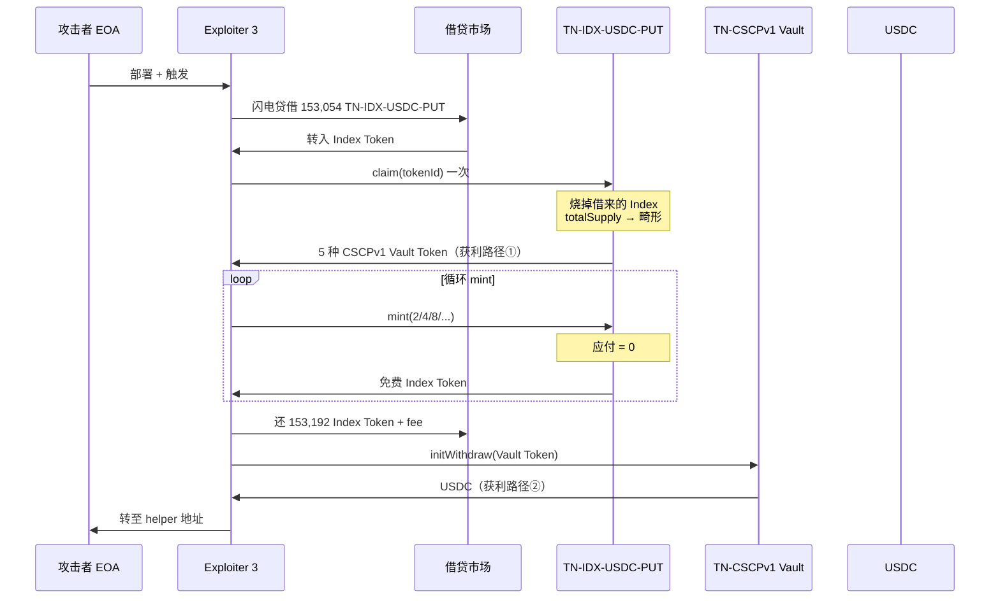
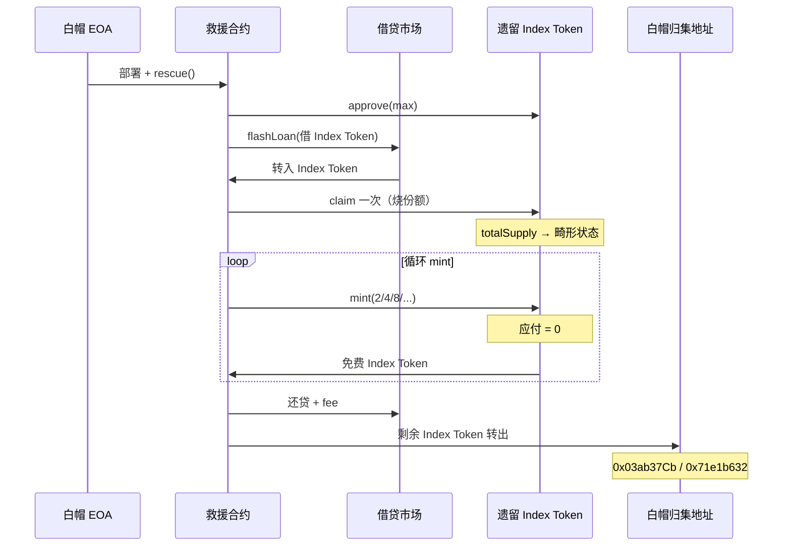

# Thetanuts Finance 遗留金库攻击 — 技术复盘

**交易哈希：** `0xbba9f138fe39503bfd1aa62932dbd6ab35d37d23d48e4b7bf2988a9d5dc39fec`  
**链：** Ethereum Mainnet  
**区块：** `25323329`（区块内 Position #0）  
**时间：** 2026-06-15 13:53:59 UTC  
**Etherscan：** https://etherscan.io/tx/0xbba9f138fe39503bfd1aa62932dbd6ab35d37d23d48e4b7bf2988a9d5dc39fec  
**Phalcon 调用链：** https://app.blocksec.com/phalcon/explorer/tx/eth/0xbba9f138fe39503bfd1aa62932dbd6ab35d37d23d48e4b7bf2988a9d5dc39fec

---

## 1. 执行摘要

2026 年 6 月 15 日，攻击者针对 **Thetanuts Finance 已废弃的遗留 Index Vault 系统** 发起单笔原子交易攻击。攻击利用遗留合约在 **低供应量（low-supply）边界条件下整数除法舍入错误**，通过闪电贷借入 Index Token、一次性 `claim` 拆包底层 Vault 份额、循环 `mint` 零成本铸份额还贷，再对底层 Vault Token 执行 `initWithdraw` 提取 USDC。

| 指标 | 数值 |
|------|------|
| 估计总损失 | ~$2.1M（PeckShield / SlowMist） |
| 白帽追回 | ~$2M 期权代币 |
| 攻击者链上留存（本 tx） | ~105,471 USDC + 部分 Vault Token |
| Gas 消耗 | 3,717,258 / 5,000,000（74.35%） |
| 交易费 | ~0.0114 ETH（~$20） |
| ERC-20 转账笔数 | 238 |
| 事件日志 | 429 |

Thetanuts 官方确认：被攻击合约为 **多年前已迁移的 deprecated vault**，与当前产品线无关。

---

## 2. 参与地址

| 角色 | 地址 | 说明 |
|------|------|------|
| 攻击者 EOA | `0x30498e4466789E534c72e03B52A16c978655b41e` | Etherscan 标注 ThetanutsFi Exploiter 1 |
| 攻击编排合约 | `0xa589c5342068b0c1fefd44d3c95354427502ac91` | 本交易内 CREATE，Exploiter 2 |
| Index 执行合约 | `0x0F9DAa9E0aDCeD4E64578B2e131930DDE54E492E` | 本交易内 CREATE，Exploiter 3 |
| 资金接收 / helper | `0xAf3a0FdBfb0e3127247b66a042310e09c32f2299` | 接收 USDC 及部分 Vault Token |
| Index Token | `0x075dA7e9EFEA6813aB0B2680423df75150120d12` | **TN-IDX-USDC-PUT** |
| 借贷市场 | `0xC2C3AE0a7b405058558C9b4a63b373486CB86Ac7` | 闪电贷来源 |
| Lending Router | `0x2ca7641b841a79cc70220ce838d0b9f8197accda` | FlashLoan 事件发射方 |
| USDC | `0xa0b86991c6218b36c1d19d4a2e9eb0ce3606eb48` | 最终变现资产 |

**底层 Vault 合约（`initWithdraw` 涉及）：**

| Vault 地址 | 链上事件 | 流出 USDC |
|------------|----------|-----------|
| `0x3BA337F3167eA35910E6979D5BC3b0AeE60E7d59` | `Withdraw` | 70,315.563951 |
| `0xE1c93dE547cc85cbd568295f6cc322b1dbBCf8Ae` | `Withdraw` | 35,155.935127 |

---

## 3. 协议架构（三层）

```
┌─────────────────────────────────────────────────────────┐
│  Layer 1: Index Token                                   │
│  TN-IDX-USDC-PUT (0x075d...)                            │
│  = 一篮子底层 Put Vault 份额的打包凭证                    │
└────────────────────┬────────────────────────────────────┘
                     │ claim（拆包，仅调用一次）
                     ▼
┌─────────────────────────────────────────────────────────┐
│  Layer 2: 底层 Vault Token                              │
│  TN-CSCPv1-BTCUSD / ETHUSD / AVAXUSD / BNBUSD / MATICUSD│
│  = 单个期权金库的份额凭证                                 │
└────────────────────┬────────────────────────────────────┘
                     │ initWithdraw（链上事件名: Withdraw）
                     ▼
┌─────────────────────────────────────────────────────────┐
│  Layer 3: Backing 资产                                  │
│  USDC / WBTC / WETH 等                                  │
└─────────────────────────────────────────────────────────┘
```

---

## 4. 漏洞根因

### 4.1 核心公式

遗留 Index Token 的 `mint` / `claim` 使用类似以下会计逻辑：

```solidity
// mint 侧：应付存款
depositAmount = backing * mintAmount / totalSupply;

// claim / initWithdraw 侧：可领取资产
payout = backing * shares / totalSupply;
```

Solidity **整数除法向下取整**。当 `totalSupply` 被压到极低，或满足 `backing × amount < totalSupply` 时：

```
depositAmount = 0  →  免费铸币
```

### 4.2 触发条件

攻击者通过一次性 `claim` 将金库推入 **低供应量畸形状态**，使后续 `mint` 在循环中持续满足零成本铸币条件。

### 4.3 遗留合约风险

- 协议已迁移，但链上合约仍可调用
- 残留 `backing` 与异常 `totalSupply` 可共存
- 无有效边界检查阻止边界态 `mint`

---

## 5. 攻击流程

### 5.1 总览

```
① 部署攻击合约（CREATE × 2）
② 闪电贷借 TN-IDX-USDC-PUT
③ claim 一次 → 拆包 + 改状态 + 获得底层 Vault Token
④ 循环 mint（2→4→8→...）→ 0 元铸 Index Token
⑤ 用 mint 出的 Index Token 还闪电贷 + 手续费
⑥ initWithdraw 底层 Vault Token → 提取 USDC
⑦ 将 USDC / 剩余 Vault Token 转至 helper 地址
```

### 5.2 分步详解

#### Step 0：合约部署

攻击者 EOA 调用 `0x60806040`（合约创建字节码），在同一交易内部署：

- `0xa589c534...` — 编排合约
- `0x0F9DAa9E...` — Index 执行合约

#### Step 1：闪电贷

```
来源：   0x2ca764... / 0xC2C3AE...
借入：   153,054,600,569 最小单位 TN-IDX-USDC-PUT
        ≈ 153,054.600569 份（6 decimals）
手续费： 137,749,140 最小单位
        ≈ 137.74914 份
```

#### Step 2：claim（仅一次）

**调用链（Phalcon / 交易解码器）：**

```
CALL  TN-IDX-USDC-PUT.claim(tokenId=153,054,600,569)   gas: 222,666
  ├─ EVENT  Transfer
  │    from: 0x0F9DAa9E0aDCeD4E64578B2e131930DDE54E492E
  │    to:   0x0000000000000000000000000000000000000000
  │    value: 153,054,600,569
  ├─ CALL  TN-CSCPv1-BTCUSD.transfer  → 49,716,431,047
  ├─ CALL  TN-CSCPv1-ETHUSD.transfer  → 23,955,277,333
  ├─ CALL  TN-CSCPv1-AVAXUSD.transfer →  6,378,688,541
  ├─ CALL  TN-CSCPv1-BNBUSD.transfer  → 17,186,382,409
  └─ CALL  TN-CSCPv1-MATICUSD.transfer→ 10,028,704,387
```

**claim 拆包明细：**

| 底层 Vault Token | 转出数量（最小单位） | 人类可读（6 dec） |
|------------------|----------------------|-------------------|
| TN-CSCPv1-BTCUSD | 49,716,431,047 | 49,716.431047 |
| TN-CSCPv1-ETHUSD | 23,955,277,333 | 23,955.277333 |
| TN-CSCPv1-AVAXUSD | 6,378,688,541 | 6,378.688541 |
| TN-CSCPv1-BNBUSD | 17,186,382,409 | 17,186.382409 |
| TN-CSCPv1-MATICUSD | 10,028,704,387 | 10,028.704387 |

所有底层 token 均转入 `0x0F9DAa9E0aDCeD4E64578B2e131930DDE54E492E`（Exploiter 3）。

**此步效果：**

- 烧掉闪电贷借来的 Index Token
- `totalSupply` 骤降，金库进入畸形状态
- 无偿获得一篮子底层 Vault 份额（获利路径 ①）

#### Step 3：循环 mint

`claim` 之后，攻击者以 **指数递增** 模式反复 `mint`：

```
mint(2) → mint(4) → mint(8) → ... → mint(134,217.728) → ...
```

链上可见大量翻倍铸币模式：

```
Null → Exploiter 3 : 0.000002, 0.000004, 0.000008, ...
Exploiter 3 → Lending : 0（应付金额为 0）
```

每次 mint 满足 `backing × amount < totalSupply`，**应付 = 0**。

**mint 在此阶段的目的：凑够数量偿还闪电贷，不是主要利润来源。**

#### Step 4：还闪电贷

```
需还：  153,054.600569 + 137.74914 = 153,192.349709 TN-IDX-USDC-PUT
来源：  循环 mint 白铸的 Index Token
```

链上转账：

```
Exploiter 3 → 0x075d... : 153,192.349709 TN-IDX-USDC-PUT
```

#### Step 5：initWithdraw → USDC

对 claim 获得的底层 Vault Token 调用 `initWithdraw`（链上事件名为 `Withdraw`）：

| Vault | USDC 提取量 |
|-------|-------------|
| `0x3BA337F3...` | 70,315.563951 USDC |
| `0xE1c93dE5...` | 35,155.935127 USDC |
| **合计** | **105,471.499078 USDC** |

USDC 最终转至 `0xAf3a0FdB...`（helper 地址）。

**重要细节（Phalcon）：** 本交易仅对 **BTCUSD、ETHUSD** 两个 vault 执行了 `initWithdraw`；**AVAXUSD、BNBUSD、MATICUSD** 未提现，而是以 Vault Token 形式直接 `transfer` 至 helper 地址。

| Vault Token | 处理方式 | 数量 | 结果 |
|-------------|----------|------|------|
| TN-CSCPv1-BTCUSD | `initWithdraw(49,716,431,047)` | 49,716.431047 | → 70,315.563951 USDC |
| TN-CSCPv1-ETHUSD | `initWithdraw(23,955,277,333)` | 23,955.277333 | → 35,155.935127 USDC |
| TN-CSCPv1-AVAXUSD | `transfer` → helper | 6,378.688541 | 保留为 Vault Token |
| TN-CSCPv1-BNBUSD | `transfer` → helper | 17,186.382409 | 保留为 Vault Token |
| TN-CSCPv1-MATICUSD | `transfer` → helper | 10,028.704387 | 保留为 Vault Token |

---

## 6. Phalcon 调用链详解

> 数据来源：[BlockSec Phalcon Invocation Flow](https://app.blocksec.com/phalcon/explorer/tx/eth/0xbba9f138fe39503bfd1aa62932dbd6ab35d37d23d48e4b7bf2988a9d5dc39fec)

### 6.1 顶层调用序列

| # | 类型 | 调用方 → 被调用方 | 函数 | 关键参数 / 返回值 |
|---|------|-------------------|------|-------------------|
| 0 | — | `0x30498e44...` → EOA | — | Sender |
| 1 | CREATE | EOA → `0xa589c534...` | 部署字节码 | 编排合约 Exploiter 2 |
| 2 | STATICCALL | → `TN-IDX-USDC-PUT` | `totalSupply()` | 返回 `153,054,600,572` |
| 3 | STATICCALL | → `TN-IDX-USDC-PUT` | `balanceOf(indexUSDC)` | 返回 `153,054,600,572` |
| 4 | CREATE | → `0x0F9DAa9E...` | 部署字节码 | 执行合约 Exploiter 3 |
| 5 | CALL | → `0x0F9DAa9E...` | `run(tokenId)` | `tokenId=153,054,600,569` → `requestId=105,471,499,078` |
| 6 | STATICCALL | → `USDC` | `balanceOf(executor)` | `0` |
| 7 | CALL | → `0x2ca764...` | `flashLoan(...)` | 见 §6.2 |

**攻击前探测：** 在部署执行合约前，先读取 `totalSupply` 与 `indexUSDC` 余额，确认 Index Token 供应量充足后再发起攻击。`run()` 返回的 `requestId=105,471,499,078` 与最终提取的 USDC 总量（105,471.499078）一致。

### 6.2 闪电贷回调（`flashLoan` 内部）

```
CALL  0x2ca7641b841a79cc70220ce838d0b9f8197accda.flashLoan(
        receiverAddress = 0x0F9DAa9E0aDCeD4E64578B2e131930DDE54E492E
        assets          = [TN-IDX-USDC-PUT]
        amounts         = [153,054,600,569]
        interestRateModes = [0]
        onBehalfOf      = 0x0F9DAa9E0aDCeD4E64578B2e131930DDE54E492E
        params          = ""
        referralCode    = 0
      )
```

回调内主要阶段（Phalcon 可见部分）：

```
┌─ flashLoan 回调 ─────────────────────────────────────────────────┐
│                                                                  │
│  [A] claim + 循环 mint + 还贷                                     │
│      （Phalcon 折叠；链上可见大量 0 元 mint 与 Index Token 流转）    │
│                                                                  │
│  [B] initWithdraw — BTCUSD                                       │
│      balanceOf(BTCUSD) = 49,716,431,047                           │
│      initWithdraw(49,716,431,047)                                │
│      balanceOf(USDC)   = 70,315,563,951                           │
│                                                                  │
│  [C] initWithdraw — ETHUSD                                       │
│      balanceOf(ETHUSD) = 23,955,277,333                           │
│      initWithdraw(23,955,277,333)                                │
│      balanceOf(USDC)   = 105,471,499,078                          │
│                                                                  │
│  [D] 转出利润                                                     │
│      USDC.transfer(0xAf3a0F..., 105,471,499,078)                 │
│                                                                  │
│  [E] 转出未变现 Vault Token                                       │
│      AVAXUSD.transfer(0xAf3a0F..., 6,378,688,541)                │
│      BNBUSD.transfer(0xAf3a0F..., 17,186,382,409)                │
│      MATICUSD.transfer(0xAf3a0F..., 10,028,704,387)               │
│                                                                  │
│  [F] 验证清仓                                                     │
│      balanceOf(IDX/BTC/ETH on executor) = 0                       │
└──────────────────────────────────────────────────────────────────┘
```

### 6.3 `claim` 内部调用（展开）

```
CALL  TN-IDX-USDC-PUT.claim(tokenId=153,054,600,569)     gas: 222,666
  ├─ EVENT  Transfer
  │    from: 0x0F9DAa9E0aDCeD4E64578B2e131930DDE54E492E
  │    to:   0x0000000000000000000000000000000000000000
  │    value: 153,054,600,569
  ├─ CALL  TN-CSCPv1-BTCUSD.transfer   → 49,716,431,047
  ├─ CALL  TN-CSCPv1-ETHUSD.transfer   → 23,955,277,333
  ├─ CALL  TN-CSCPv1-AVAXUSD.transfer  →  6,378,688,541
  ├─ CALL  TN-CSCPv1-BNBUSD.transfer   → 17,186,382,409
  └─ CALL  TN-CSCPv1-MATICUSD.transfer → 10,028,704,387
```

### 6.4 余额变动（Phalcon Balance Changes）

| 地址 | Token | 变动量 | USD 估值 |
|------|-------|--------|----------|
| `0x000...000`（销毁） | TN-IDX-USDC-PUT | -137.74914 | — |
| `0x000...000`（销毁） | TN-CSCPv1-ETHUSD | +23,955.277333 | — |
| `0x000...000`（销毁） | TN-CSCPv1-BTCUSD | +49,716.431047 | — |
| `indexUSDC`（借贷池） | TN-IDX-USDC-PUT | +137.74914 | — |
| TN-CSCPv1-BTCUSD vault | USDC | -70,315.563951 | -$70,295.15 |
| TN-CSCPv1-ETHUSD vault | USDC | -35,155.935127 | -$35,145.73 |
| `0xAf3a0FdB...`（helper） | USDC | +105,471.499078 | +$105,440.88 |
| `0xAf3a0FdB...`（helper） | TN-CSCPv1-AVAXUSD | +6,378.688541 | — |
| `0xAf3a0FdB...`（helper） | TN-CSCPv1-BNBUSD | +17,186.382409 | — |
| `0xAf3a0FdB...`（helper） | TN-CSCPv1-MATICUSD | +10,028.704387 | — |
| TN-IDX-USDC-PUT | TN-CSCPv1-* | 各 -claim 数量 | — |

---

## 7. 资金流图



---

## 8. 利润构成

| 来源 | 资产类型 | 本交易可见金额 | 性质 |
|------|----------|----------------|------|
| claim 拆包 | 5 种 TN-CSCPv1-* | 见 §5.2 / §6.3 | 获利路径 ①（无偿拆包） |
| initWithdraw | USDC（BTC+ETH vault） | 105,471.499078 | 获利路径 ②（USDC 变现） |
| 未变现转出 | AVAX/BNB/MATIC Vault Token | 33,593.775337 合计 | 获利路径 ③（头寸转出） |
| mint | TN-IDX-USDC-PUT | 仅用于还贷 | 非利润主来源 |

PeckShield 统计整次事件总损失约 **$2.1M**（含本交易及关联头寸），其中约 **$2M** 被白帽在同一时间窗口抢回。攻击者后续将约 **$105k USDC** 换成 ~60 ETH。

---

## 9. 关键链上证据

### 8.1 闪电贷事件（Log #418）

```
FlashLoan(
  target    = 0x0F9DAa9E...
  initiator = 0x0F9DAa9E...
  asset     = 0xC2C3AE0a...
  amount    = 153054600569
  premium   = 137749140
)
```

### 8.2 claim 销毁

```
From 0x075d... → Exploiter 3 : 153,054.600569 TN-IDX-USDC-PUT
From Exploiter 3 → 0x000...   : 153,054.600569（销毁）
```

### 8.3 mint 指数模式（部分）

```
Null → Exploiter 3 : 0.000002
Null → Exploiter 3 : 0.000004
Null → Exploiter 3 : 0.000008
...
Null → Exploiter 3 : 134.217728
Null → Exploiter 3 : 268.435456
```

### 8.4 还贷

```
Exploiter 3 → 0x075d... : 153,192.349709 TN-IDX-USDC-PUT
```

### 8.5 initWithdraw（Log #421 Withdraw）

```
Vault 0x3BA337F3...
  Withdraw(user=Exploiter3, amount=70315563951)  → 70,315.56 USDC

Vault 0xE1c93dE5...
  Withdraw(user=Exploiter3, amount=35155935127)  → 35,155.94 USDC
```

---

## 10. 攻击特征

| 特征 | 表现 |
|------|------|
| 原子性 | 借、claim、mint、还贷、提现全在一笔 tx |
| 抢跑位 | Block position #0 |
| 合约创建 | 交易内 CREATE 两个新合约 |
| Gas 策略 | Max fee 18 Gwei，实际 3.07 Gwei |
| 批量操作 | 238 次 ERC-20 转账，429 条事件 |
| 指数 mint | 2^n 递增，最大化零成本铸币窗口 |
| claim 单次 | 拆包 5 种 CSCPv1 底层资产后不再 claim |

---

## 11. 整数除法边界（附录）

当 `totalSupply = 3, mintAmount = 2` 时：

```
应付 = backing × 2 / 3
```

要使结果为 0，需 `backing × 2 < 3`，即 `backing = 0 或 1`。

攻击并非停在 `backing = 1` 的玩具状态，而是：

1. **claim 一次** 将金库推入畸形 `totalSupply` 状态
2. **循环 mint** 在边界窗口内零成本铸币
3. **claim 拆出的 Vault Token** 仍对应有真实 backing，经 **initWithdraw** 兑现

---

## 12. 根因归类与修复建议

**漏洞类型：** Business Logic Flaw / Integer Division Rounding at Low Supply

**修复建议：**

1. `totalSupply` 低于阈值时 revert `mint`
2. `depositAmount == 0` 时 revert（禁止零成本铸币）
3. `totalSupply == 0 && backing > 0` 时禁止新 deposit，或强制清算残留资产
4. 废弃合约应链上 pause 或迁移剩余资产，而非仅前端下线
5. `mint` / `claim` / `initWithdraw` 使用统一会计状态源

---

## 13. 参考资料

- [Etherscan 交易详情](https://etherscan.io/tx/0xbba9f138fe39503bfd1aa62932dbd6ab35d37d23d48e4b7bf2988a9d5dc39fec)
- [BlockSec Phalcon 调用链 / 余额变动](https://app.blocksec.com/phalcon/explorer/tx/eth/0xbba9f138fe39503bfd1aa62932dbd6ab35d37d23d48e4b7bf2988a9d5dc39fec)
- PeckShield Alert（2026-06-15）：~$2.1M exploit，~$2M whitehatted
- Blockaid：low-supply accounting flaw in index-token mint/claim math
- SlowMist / ExVul：legacy vault redemption / mint integer division
- Thetanuts 官方：deprecated vault，与当前产品无关
- [Etherscan 白帽救援交易](https://etherscan.io/tx/0x4c0a75e27855f350c95e3dc64906b1b2f19e6649fdfd0d9374f3915067418bc1)
- [BlockSec Phalcon 白帽调用链](https://app.blocksec.com/phalcon/explorer/tx/eth/0x4c0a75e27855f350c95e3dc64906b1b2f19e6649fdfd0d9374f3915067418bc1)

---

## 14. 一句话总结

> 攻击者经 `run(tokenId)` 触发 `flashLoan`，在回调内 `claim` 拆出 5 种 `TN-CSCPv1-*`，循环 `mint` 还贷，再对 BTC/ETH vault 执行 `initWithdraw` 提取 **105,471 USDC**，其余 AVAX/BNB/MATIC 份额转至 helper；整笔攻击在一笔以太坊交易中完成。

---

## 15. 白帽救援交易

**交易哈希：** `0x4c0a75e27855f350c95e3dc64906b1b2f19e6649fdfd0d9374f3915067418bc1`  
**链：** Ethereum Mainnet  
**区块：** `25323629`（区块内 Position #0）  
**时间：** 2026-06-15 14:53:59 UTC（攻击交易约 **1 小时后**，区块差 +300）  
**Etherscan：** https://etherscan.io/tx/0x4c0a75e27855f350c95e3dc64906b1b2f19e6649fdfd0d9374f3915067418bc1  
**Phalcon：** https://app.blocksec.com/phalcon/explorer/tx/eth/0x4c0a75e27855f350c95e3dc64906b1b2f19e6649fdfd0d9374f3915067418bc1

| 指标 | 数值 |
|------|------|
| 发起方 | `0x03ab37CbD9aEaC17B1d8c53517F7D01E5E889130`（Etherscan：**ThetanutsFi White Hat 1**） |
| 救援合约 | `0x01633e8d...F3161782d`（本交易内 CREATE） |
| Gas 消耗 | 2,539,277 / 10,000,000（25.39%） |
| 交易费 | ~0.00388 ETH（~$7） |
| ERC-20 转账笔数 | 170 |
| 估计救回头寸 | ~$2M 期权代币（PeckShield） |

### 15.1 救援本质：不是“从攻击者手里扣回”

白帽 **并未** 追回攻击者已落袋的 ~105k USDC 及 helper 地址上的 Vault Token。救援对象是：

> **攻击发生后，遗留金库中仍可被同一漏洞提取的剩余 Index / Vault 头寸。**

白帽在攻击约 1 小时后介入，用 **与攻击者相同的技术路径**（闪电贷 → `claim` → 循环 `mint` → 还贷），但将提取出的期权代币导向 **白帽控制地址**，抢在更多攻击者之前锁定资产。

### 15.2 与攻击交易对比

| 维度 | 攻击者（§5） | 白帽（本节） |
|------|-------------|-------------|
| EOA | `0x30498e44...` Exploiter 1 | `0x03ab37Cb...` White Hat 1 |
| 区块 | `25323329` | `25323629`（+300） |
| 主要 Index | `TN-IDX-USDC-PUT`（`0x075d...`） | 多个遗留 Index（见 §15.3） |
| 闪电贷借入量 | 153,054,600,569 | 3,719,814,997（单笔可见） |
| 后续动作 | `initWithdraw` 变现 USDC | 主要保留 Index Token，转白帽地址 |
| 利润去向 | `0xAf3a0FdB...` helper | `0x03ab37Cb...` / `0x71e1b632...` |
| 目的 | 窃取资产 | 抢救剩余暴露头寸 |

### 15.3 参与地址

| 角色 | 地址 | 说明 |
|------|------|------|
| 白帽 EOA | `0x03ab37CbD9aEaC17B1d8c53517F7D01E5E889130` | 救援发起方，最终接收部分 Index Token |
| 救援合约 | `0x01633e8d...` | 交易内 CREATE，硬编码多合约地址 |
| Lending Router | `0x2ca7641b841a79cc70220ce838d0b9f8197accda` | 与攻击者相同闪电贷来源 |
| Index Token A | `0x95C59DAf5950101d6afa6875091B48f5A36278c2` | 遗留 Index（非攻击者用的 USDC-PUT） |
| Index Token B | `0x4A47e9D2C85aA856A0B0DC887876399f7230C273` | 另一遗留 Index，救援循环主要操作对象 |
| 归集地址 | `0x71e1b632F1dDC20F79dF1472F7a464779588A6D1` | 接收部分救回 Index Token |
| 硬编码 Vault/Index | `0x3b2d3102944dec6c4d7b0d87ca9de6eb13b70c11e` | 救援合约构造参数 |
| 硬编码 Vault/Index | `0xb1105529305f166531b7d857b1d6f28000278aff` | 救援合约构造参数 |

### 15.4 救援流程

```
① 白帽 EOA 部署救援合约（CREATE）
② 对 Lending Router、多个 Index Token 执行 approve(max)
③ 调用 rescue()（selector: a04a0908）
④ 对多个遗留 Index 循环：
      flashLoan 借 Index Token
        ↓
      claim 一次 → 烧份额、改 totalSupply 状态
        ↓
      循环 mint → 零成本铸币（链上可见 100+ 笔 0 元转账）
        ↓
      还贷 + 手续费
        ↓
      剩余 Index Token 转白帽地址
⑤ 交易结束，头寸锁定在白帽控制地址
```

**救援合约入口函数（从字节码解码）：**

| Selector | 推测用途 |
|----------|----------|
| `a04a0908` | 主入口 `rescue()`：授权 + 循环触发闪电贷 |
| `920f5c84` | 闪电贷回调：执行 claim / mint / 还贷 / 转出 |
| `1bce6ff3` | 子合约 CREATE（与攻击者编排模式类似） |
| `ab9c4b5d` | 调用 `0x2ca764...flashLoan(...)` |

### 15.5 链上证据

#### 闪电贷（Log #280）

```
FlashLoan(
  target    = 0x95C59DAf...（救援合约）
  initiator = 0x95C59DAf...
  asset     = 0x95C59DAf...（Index Token）
  amount    = 3,719,814,997   ≈ 3,719.815 份（6 dec）
  premium   = 3,347,833       ≈ 3.348 份
)
```

#### claim + mint 模式（事件 #3–#8 及后续循环）

```
0x4A47e9D2 → 救援合约 : 3,719,814,997   ← 闪电贷到账
救援合约 → 0x000...000 : 3,719,814,997   ← claim 销毁
0x4A47e9D2 → 救援合约 : 1,954,158,129   ← claim / mint 中间态
0x4A47e9D2 → 救援合约 : 1,965,116,184
0x95C59DAf → 救援合约 : 0               ← 零成本 mint（应付 = 0）
...（全交易共 100+ 笔 value=0 的 mint 转账）
```

#### 救回资产归集（交易末尾）

| 接收方 | Token | 数量（最小单位） | 约可读（6 dec） |
|--------|-------|------------------|-----------------|
| `0x03ab37Cb...`（白帽 EOA） | Index Token | 1,513,459,587 | 1,513.460 |
| `0x03ab37Cb...` | Index Token | 1,954,158,129 | 1,954.158 |
| `0x03ab37Cb...` | Index Token | 1,965,116,184 | 1,965.116 |
| `0x71e1b632...` | Index Token | 3,723,162,830 | 3,723.163 |

上述为单笔交易末尾可见的部分归集；全交易对 **多个遗留 Index** 重复同样操作，合计对应 PeckShield 报告的 **~$2M 期权代币被 whitehat 救回**。

### 15.6 救援资金流图



### 15.7 关键结论

1. **白帽 ≠ 攻击者**：不同 EOA、不同目的；白帽是善意第三方抢救资金。
2. **技术路径相同**：同样利用 low-supply 整数除法漏洞，不是正规 `redeem` 或协议升级迁移。
3. **覆盖范围更广**：攻击者主要打 `TN-IDX-USDC-PUT`；白帽对 **多个遗留 Index** 批量执行相同 exploit。
4. **无法追回已偷部分**：攻击者 helper 上的 ~105k USDC 及未变现 Vault Token 不在本救援交易范围内。
5. **抢跑竞争**：两笔交易均为区块 Position #0，体现与潜在后续攻击者的竞速关系。

> **一句话：** 白帽在攻击 1 小时后，用相同的「闪电贷 + claim + mint」路径批量提取多个遗留 Index 的暴露头寸，转入白帽控制地址，救回约 $200 万期权代币，而非从攻击者处追回已盗资产。

